# Title: Colour Analysis Software

**Assessment Name:** Introduction to Software Engineering (ISAD1000/5004) – ISE Assignment 2025 S1  
**Student Name:** Muhammad Mustafa Ghauri  
**Curtin Student ID:** 21856831  
**Practical Class:** Friday 12:00 PM – 2:00 PM 

**ISE Assignment 2025**

## Overview:

This project covers all the phases of working on a modular colour analysis tool as a software engineering project. Using the application, users can experiment with electromagnetic data enter with colour names, frequencies or wavelengths. As a result, the system gives important information about the colour, categorises it by its spectrum (seen as visible, ultraviolet, infrared) and connects it to musical notes, gemstones and emotions. The examples used in Figures 1 and 2 of the assignment brief formed the basis for these features.

I built the project using Python 3 on Linux and used good modularity principles as I programmed. Modules were each designed separately to have just one clear job, so they can be reused and leveraged as needed. With a command-line interface, interaction is easier and with file-based input, the software is suitable for different types of use.

In addition, the project performs thorough software testing through the use of black-box and white-box approaches. All core modules and edge cases were tested with the `unittest` library. Traceability, teamwork and adherence to software development best practices were achieved by using Git as our version control system.

This assignment produced a working tool while also proving that the student can modularize, review and improve code, test methods systematically and provide needed software documentation—all of which are important in real-life software projects.

---

## Objectives

The primary objectives of this project are:

- **To design and develop a modular software solution** that adheres to sound principles of software engineering, using clearly defined and reusable functions.
- **To validate the correctness of the code** using structured black-box and white-box testing techniques, ensuring accurate handling of both valid and invalid inputs.
- **To document and manage the development lifecycle** using a version control system (Git) that maintains a traceable history of all changes made across the codebase and associated documents.
- **To generate a detailed markdown report** that outlines the development process, design decisions, testing strategies, and version control insights for the purpose of knowledge transfer and reproducibility.

---

## Key Features

- Converts frequency to wavelength and vice versa.
- Identifies colours from THz frequency values.
- Categorizes input into spectral ranges: Visible, Infrared, Ultraviolet.
- Provides mappings of colours to:
  - Gemstones (e.g., violet → Amethyst)
  - Musical notes (e.g., blue → A)
  - Emotions (e.g., yellow → Happy)
- Command-line interface with both manual input and file-based operations.
- Modular programming structure and test-driven development.

---

## Module Descriptions

This section details how the original colour analysis module was divided into different tasks. All the modules were made according to the principles of modularity which stress high cohesion, low coupling, reuse, being clear and being tested. The design allows modules to be both used interactively and tested with automated methods.

---

### 1. `get_frequency_range(colour)`
- **Purpose:** Returns the frequency range (in THz) for a specified visible colour.
- **Inputs:** `colour` (string)
- **Outputs:** Tuple of lower and upper frequency bounds (e.g., `(530, 599)`) or `None` if invalid.
- **Input Method:** Parameter passing
- **Output Method:** Return value
- **Justification:** Essential for retrieving frequency ranges for valid colour names. Modular design allows isolation and reuse in multiple contexts, including test automation.


*Figure 1: Output showing the frequency range for the colour 'green'.*

---

### 2. `frequency_to_wavelength(frequency_thz)`
- **Purpose:** Converts frequency (THz) to wavelength (nm) using the formula:  
  _wavelength (nm) = (3 × 10⁸ m/s) / (frequency × 10¹² Hz)_ → simplified to _300000 / frequency_
- **Inputs:** `frequency_thz` (float)
- **Outputs:** Wavelength in nanometres (float)
- **Input Method:** Parameter passing
- **Output Method:** Return value
- **Justification:** Physics-driven calculation needed for interpretation and translation of EM spectrum data.

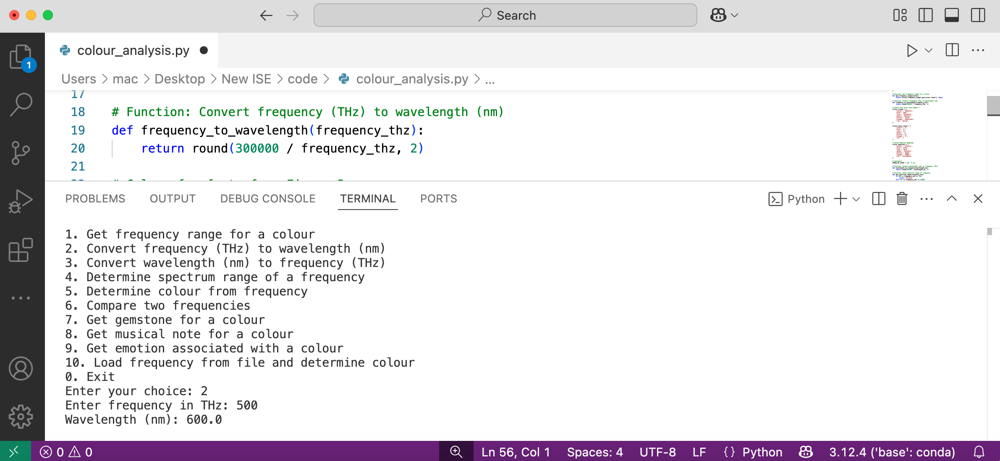 

*Figure 2: `frequency_to_wavelength()` function and CLI output for 500 THz → 600.0 nm.*

---

### 3. `wavelength_to_frequency(wavelength_nm)`
- **Purpose:** Converts wavelength (nm) to frequency (THz).
- **Inputs:** `wavelength_nm` (float)
- **Outputs:** Frequency in THz (float)
- **Input Method:** Parameter passing
- **Output Method:** Return value
- **Justification:** Inverse operation of the previous module. Separated to respect the Single Responsibility Principle.

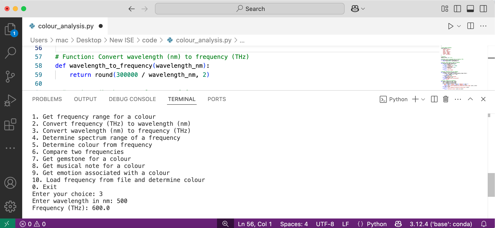  

*Figure 3: wavelength_to_frequency()` function and CLI output for 500 nm → 600.0 THz.*

---

### 4. `get_spectrum_range(frequency_thz)`
- **Purpose:** Categorizes the input frequency into spectral ranges: `Infrared`, `Visible`, `Ultraviolet`, or `Out of Range`.
- **Inputs:** `frequency_thz` (float)
- **Outputs:** Category name (string)
- **Input Method:** Parameter passing
- **Output Method:** Return value
- **Justification:** Encapsulates logic for EM classification. Critical for validation and messaging.

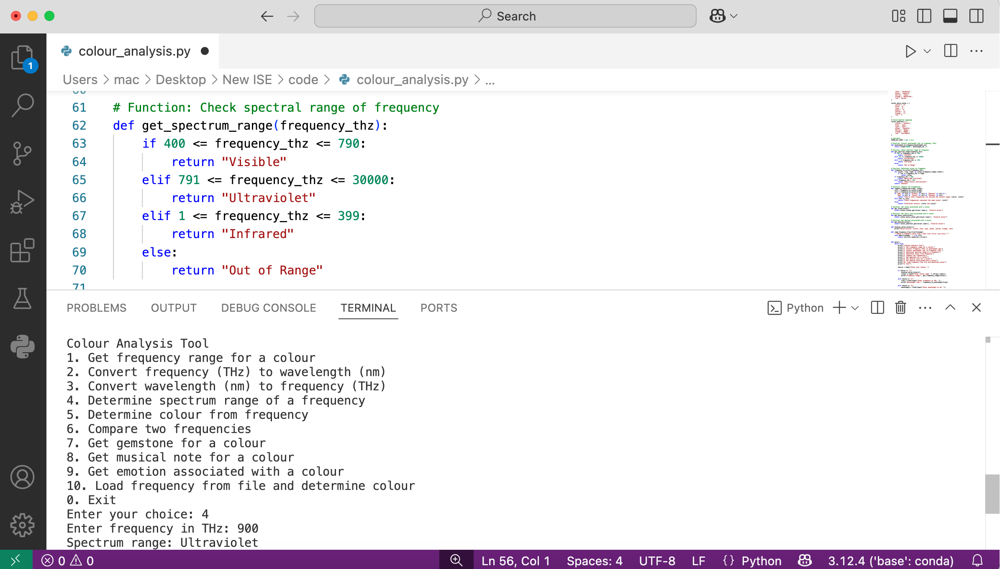  

*Figure 4: `get_spectrum_range()` classification logic.*

---

### 5. `frequency_to_colour(frequency_thz)`
- **Purpose:** Maps a given frequency to its associated colour name if within the visible range. If outside, returns a contextual message.
- **Inputs:** `frequency_thz` (float)
- **Outputs:** Colour name or category message (string)
- **Input Method:** Parameter passing
- **Output Method:** Return value
- **Justification:** Central module of the application. Supports both analytical and user-facing functionality.
- 
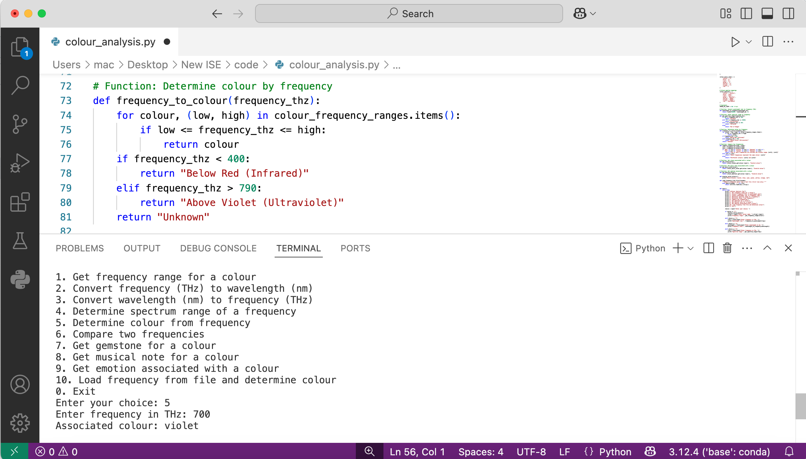  

*Figure 5: Function and Output: Conversion of Frequency to Colour*

---

### 6. `compare_frequencies(freq1, freq2)`
- **Purpose:** Compares two frequencies and determines if they map to the same colour, different colours, or are outside the visible range.
- **Inputs:** `freq1`, `freq2` (float)
- **Outputs:** Human-readable comparison message (string)
- **Input Method:** Parameter passing
- **Output Method:** Return value
- **Justification:** Provides comparative analysis logic, improving UX by handling edge and invalid cases robustly.

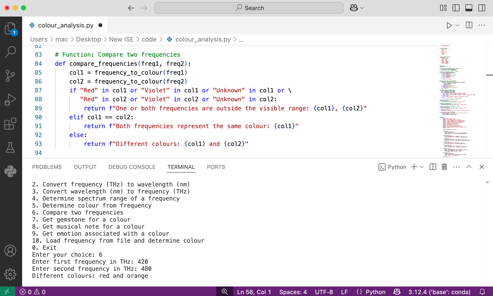  

*Figure 6: Function and Output: Comparing two Frequencies*

---

### 7. `get_stone(colour)`
- **Purpose:** Returns the gemstone linked to a valid colour.
- **Inputs:** `colour` (string)
- **Outputs:** Gemstone (string)
- **Input Method:** Parameter passing
- **Output Method:** Return value
- **Justification:** Implements factual mapping (from Figure 2) while supporting fun/educational use cases.

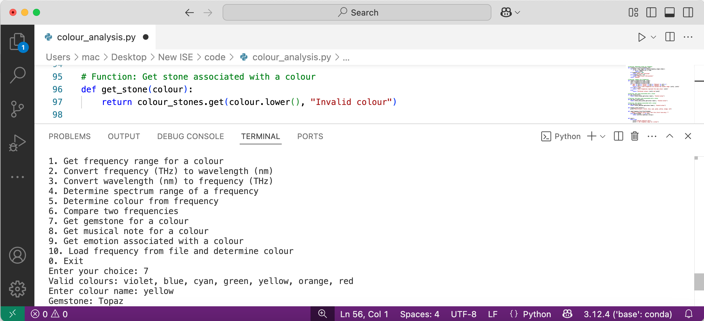  

*Figure 7: Function and Output: Get Stone Associated with a Colour*

---

### 8. `get_music_note(colour)`
- **Purpose:** Returns the musical note associated with a colour.
- **Inputs:** `colour` (string)
- **Outputs:** Note (string)
- **Input Method:** Parameter passing
- **Output Method:** Return value
- **Justification:** Analogous to `get_stone()`, enriches the application with cross-disciplinary insight.

  

*Figure 8: Function and Output: Get Music Note Associated with a Colour*

---

### 9. `get_emotion(colour)`
- **Purpose:** Returns the emotion associated with a given colour.
- **Inputs:** `colour` (string)
- **Outputs:** Emotion (string)
- **Input Method:** Parameter passing
- **Output Method:** Return value
- **Justification:** Provides emotional context, enhancing the user experience through psychological dimensions.

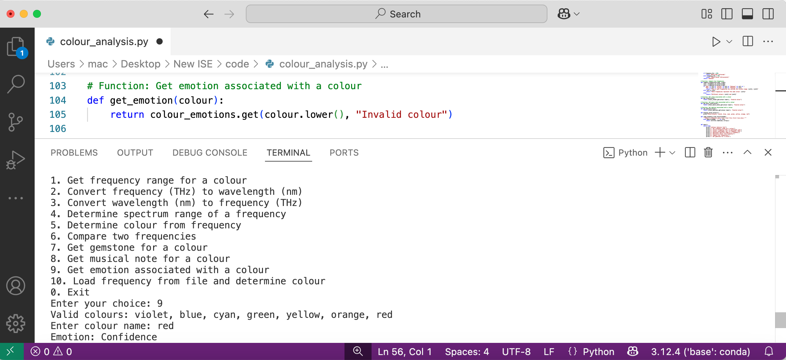  

*Figure 9: Function and Output: Get Emotion Associated with a Colour*

---

### 10. `read_frequency_from_file(filename)`
- **Purpose:** Reads a frequency value from the first line of a given text file.
- **Inputs:** `filename` (string)
- **Outputs:** Frequency (integer)
- **Input Method:** File input
- **Output Method:** Return value
- **Justification:** Enables file-based input testing and automation. Especially useful for batch processing.

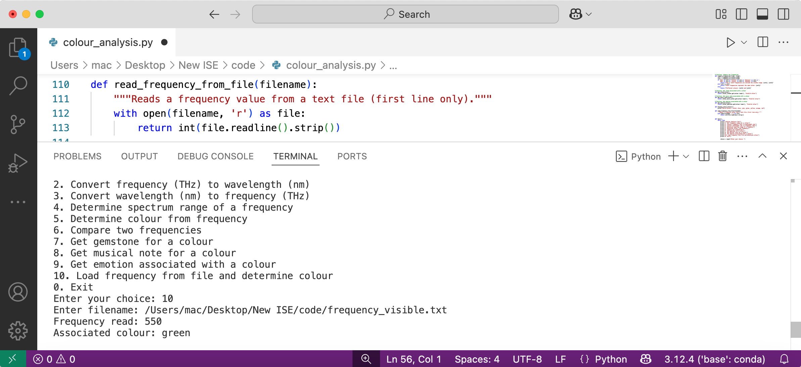  

*Figure 10: Function and Output: Example of Reading Data from Files*

---

## Design Decisions and Assumptions

The modularization strategy was guided by the following design principles:

- **Single Responsibility Principle:** Each function handles a narrowly defined task.
- **Loose Coupling:** Minimal interdependencies between modules allow for isolated testing.
- **High Cohesion:** Modules focus exclusively on one conceptual task (e.g., conversion, lookup, classification).
- **Testability:** Functions are parameter-driven, facilitating clean unit tests without the need for mocking global state.

**Assumptions Made:**
- Only colour names listed in Figures 1 and 2 are considered valid.
- Frequency values are restricted to the range 1–40,000 THz, as per the assignment brief.
- File-based inputs will always contain an integer on the first line and be accessible at runtime.
- Edge values (e.g., 400 THz, 790 THz) fall inclusively within the visible range.

This decomposition enables future scalability (e.g., extending to RGB codes, audio outputs, web integration) while maintaining strong internal structure.

---

## Modularity 

This section assesses how the `colour_analysis.py` program follows modular design principles. It explains how to run the program, shows what the program produces using labeled pictures, details the review process of the modular structure and describes any improvements found.

---

### How to Run the Production Code

If you have a Python 3 terminal, navigate to the program’s directory and enter this command:

```bash
python3 code/colour_analysis.py
```

Figure 1 to Figure 11 show the application running selected modules in real time:

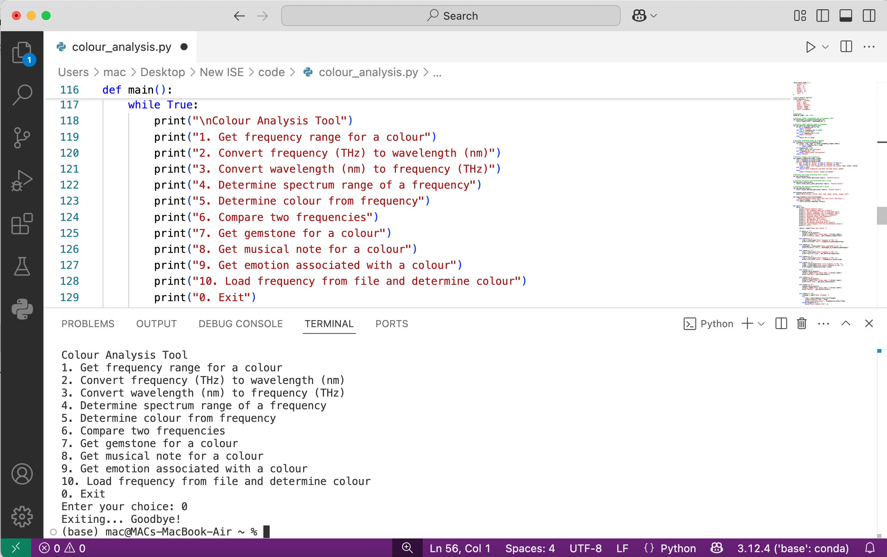  

*Figure 11: Menu and Sample Usage*

---

### Application of Modularity Concepts

The code was developed with attention to widely accepted modularity principles, ensuring readability, testability, and future extensibility:

- **Single Responsibility**: Each function is responsible for one specific task, such as conversion, classification, or mapping.

- **Encapsulation**: Logic is confined within clearly defined functions, without polluting the global namespace.

- **Loose Coupling**: Functions are independent and communicate solely through parameters and return values.

- **Reusability**: Utility functions (e.g., `get_emotion()`, `read_frequency_from_file()`) are generic and can be reused in other projects.

- **Scalability**: The current architecture makes it easy to extend functionality without refactoring existing logic.

---

### Review Checklist and Evaluation Results

Each function was reviewed using a modularity checklist adapted from lecture guidelines. The review results are as follows:

| Review Criteria                         | Status   | Comments                                        |
|----------------------------------------|----------|-------------------------------------------------|
| Single Responsibility Principle         | ✅ Pass  | Each function performs a single defined task.   |
| Clear and consistent naming             | ✅ Pass  | Function and variable names are descriptive.    |
| Input/Output handling is well-defined   | ✅ Pass  | Uses parameters and return values consistently. |
| Code duplication avoidance              | ✅ Pass  | No redundant logic detected.                    |
| Use of local scope and constants        | ✅ Pass  | Global scope limited to constants only.         |
| Reusability across different contexts   | ✅ Pass  | Functions can be reused in other applications.  |
| High cohesion within modules            | ✅ Pass  | Code within each function is tightly related.   |

---

### Refactoring Decisions and Improvements

Changes were made according to the review recommendations:

- For every function, clear docstrings and comments were added in the code.
- Using try-except blocks, I handled the situation when the specified file wasn’t present or accessible.
- Semantic Constants: Wasting space with magic numbers was cured by replacing them with named constants such as SPEED_OF_LIGHT.

Because the initial design was strong and best practices were followed, the overall function structure did not change.

---
## Test Execution 

This section presents the results of each individual unit test executed using the unittest framework. Screenshots validate that each function behaves as expected. Tests are grouped by category: black-box, white-box, utility, file-based, and custom student ID validation.


### Black-box Test Cases

Black-box testing was performed using **Equivalence Partitioning (EP)** and **Boundary Value Analysis (BVA)** techniques. These methods were applied to validate module behavior under both expected and unexpected input conditions.

---

#### Assumptions Made

- Only the colour names defined in the application are considered valid.
- Inputs are assumed to be correctly typed (i.e., strings for colour names, floats/integers for frequencies).
- File-based inputs contain one frequency per file (first line only is used).

---

#### Equivalence Partitioning (EP) Test Cases

| Test Case ID | Function Tested          | Input        | Expected Output             | Valid Partition | Comments                       |
|--------------|--------------------------|--------------|-----------------------------|-----------------|--------------------------------|
| EP01         | `get_frequency_range`    | "green"      | (530, 599)                  | Yes             | Valid colour                   |
| EP02         | `get_frequency_range`    | "pink"       | None                        | No              | Invalid colour                 |
| EP03         | `get_stone`              | "cyan"       | "Turquoise"                 | Yes             | Valid mapping                  |
| EP04         | `get_stone`              | "black"      | "Invalid colour"            | No              | Not in dataset                 |
| EP05         | `get_music_note`         | "red"        | "C"                         | Yes             | Valid note                     |
| EP06         | `get_music_note`         | "brown"      | "Invalid colour"            | No              | Invalid input                  |
| EP07         | `get_emotion`            | "orange"     | "Happy"                     | Yes             | Valid mapping                  |
| EP08         | `get_emotion`            | "silver"     | "Invalid colour"            | No              | Not mapped                     |

---
**EP01: test_get_frequency_range_valid**

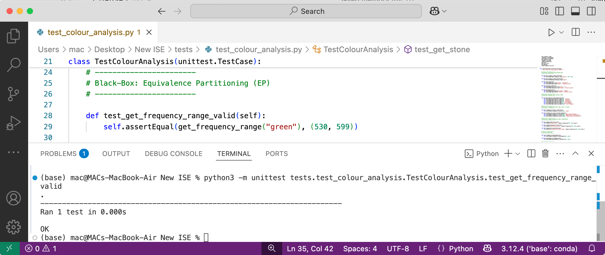  

**EP02: test_get_frequency_range_invalid**

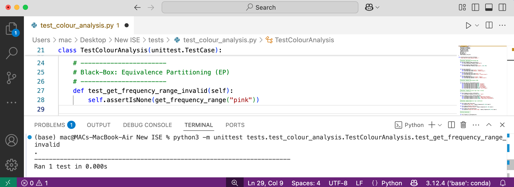  

**EP03 and 04: test_get_stone**

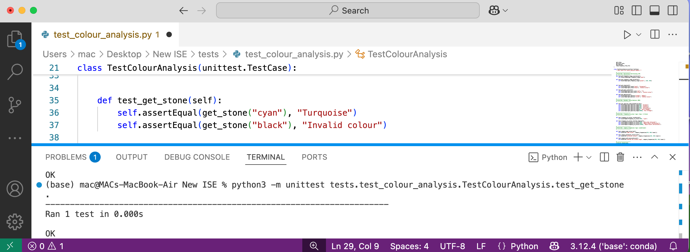  

**EP05 and 06: test_get_music_note**

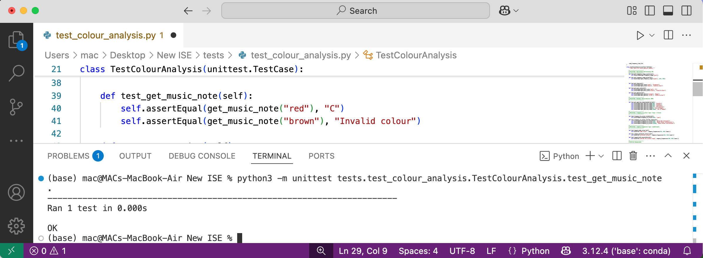  

**EP07 and 08: test_get_emotion**

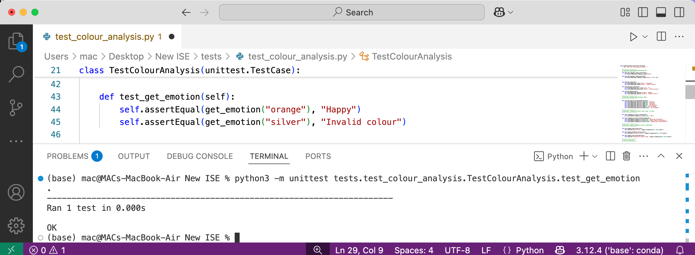  

### Boundary Value Analysis (BVA) Test Cases

| Test Case ID | Function Tested          | Input (THz) | Expected Output     | Boundary Type       |
|--------------|--------------------------|-------------|---------------------|----------------------|
| BVA01        | `get_spectrum_range`     | 400         | "Visible"           | Lower bound visible |
| BVA02        | `get_spectrum_range`     | 790         | "Visible"           | Upper bound visible |
| BVA03        | `get_spectrum_range`     | 399         | "Infrared"          | Just below visible  |
| BVA04        | `get_spectrum_range`     | 791         | "Ultraviolet"       | Just above visible  |
| BVA05        | `get_spectrum_range`     | 0           | "Out of Range"      | Below valid range   |
| BVA06        | `get_spectrum_range`     | 45000       | "Out of Range"      | Above valid range   |

---
**test_get_spectrum_range_boundaries**

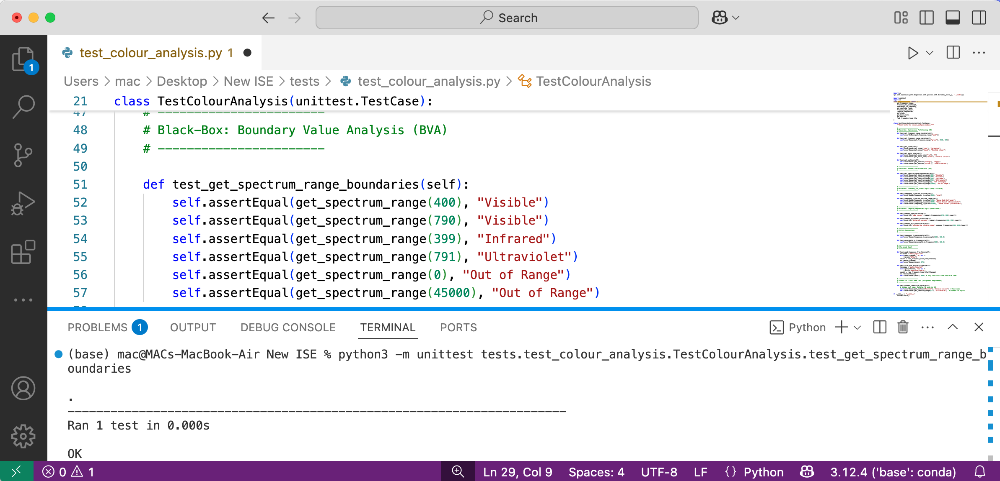  

----

## White-box Test Cases

White-box testing was applied to validate internal logic and decision-making within functions using **path coverage** and **conditional logic testing**.

---

### Selected Modules and Path-Based Test Cases

| Test Case ID | Function Tested             | Input(s)           | Expected Output                    | Path Type         |
|--------------|-----------------------------|--------------------|------------------------------------|-------------------|
| WB01         | `frequency_to_colour`       | 600                | "cyan"                             | Loop + if-else    |
| WB02         | `frequency_to_colour`       | 850                | "Above Violet (Ultraviolet)"       | Out-of-range path |
| WB03         | `frequency_to_colour`       | 350                | "Below Red (Infrared)"             | Out-of-range path |
| WB04         | `compare_frequencies`       | 670, 680           | Contains \"same colour\"            | Same condition    |
| WB05         | `compare_frequencies`       | 420, 650           | Contains \"different colours\"       | Different branch  |
| WB06         | `compare_frequencies`       | 200, 850           | Contains \"outside the visible\"     | Mixed visibility  |

These test cases cover key branches in control structures and ensure that all logical paths are exercised.

----
**test_frequency_to_colour_visible**

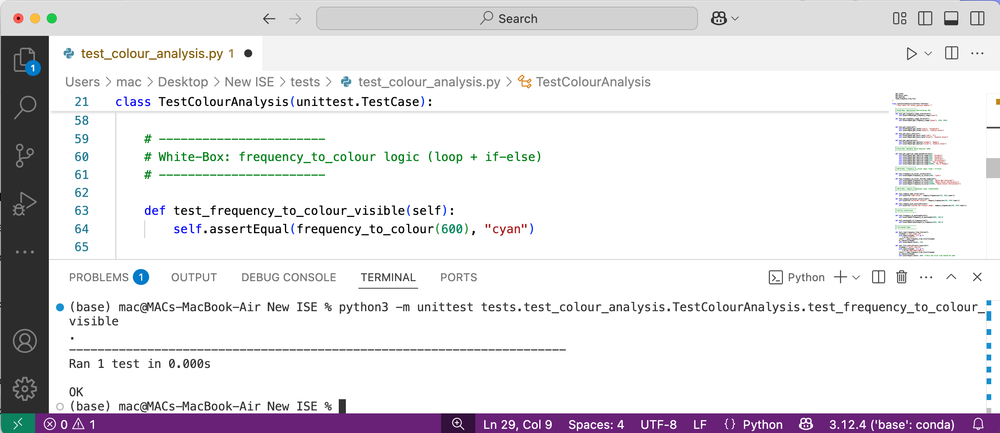  

----

**test_frequency_to_colour_outside_range**

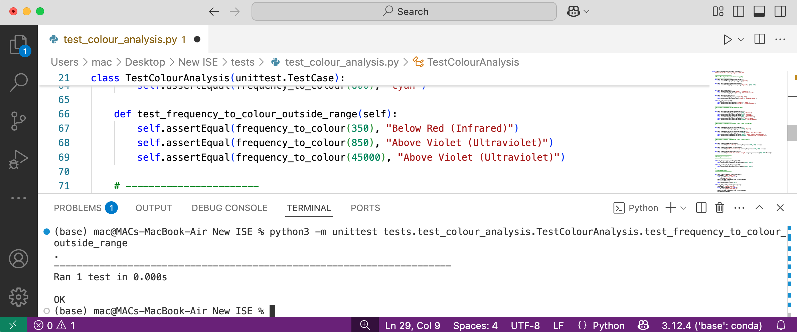  

----
**test_compare_same_colour**

  

----

**test_compare_different_colours**

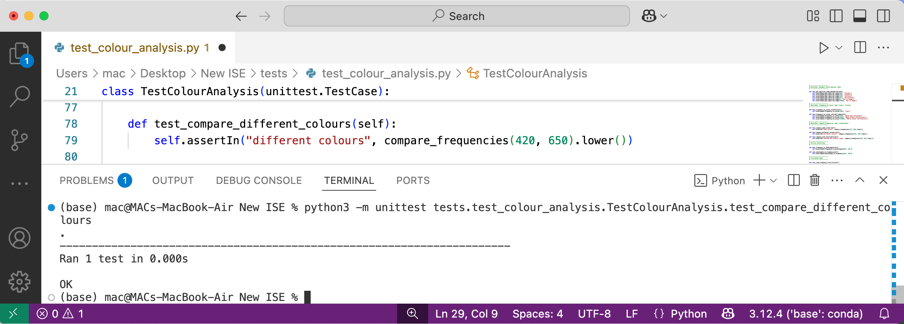  

----

**test_compare_with_nonvisible**

  

---

## Test Implementation and Execution

The test suite was implemented in the `tests/test_colour_analysis.py` file using Python’s built-in `unittest` framework. All tests target functions from the `colour_analysis.py` module.

---
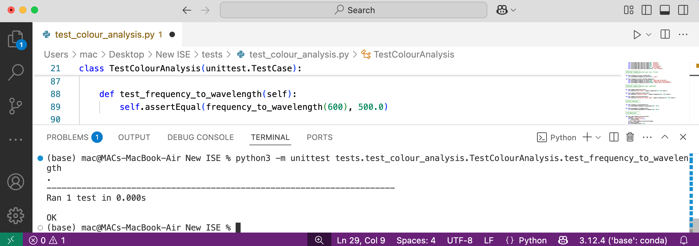  

---
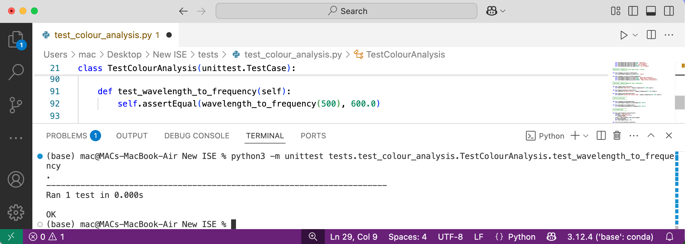  

---
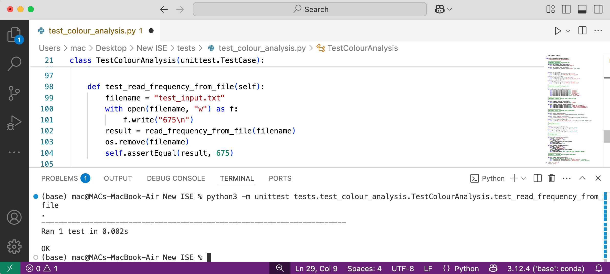  

---
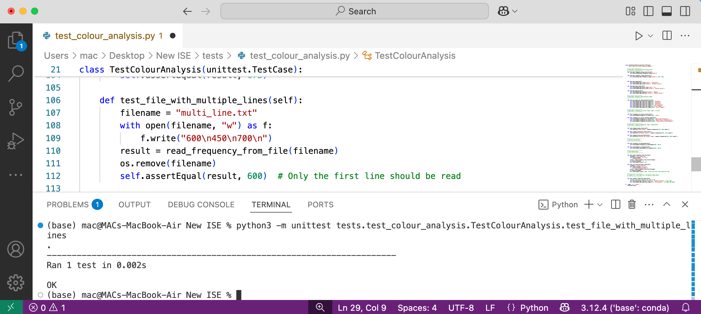  

---
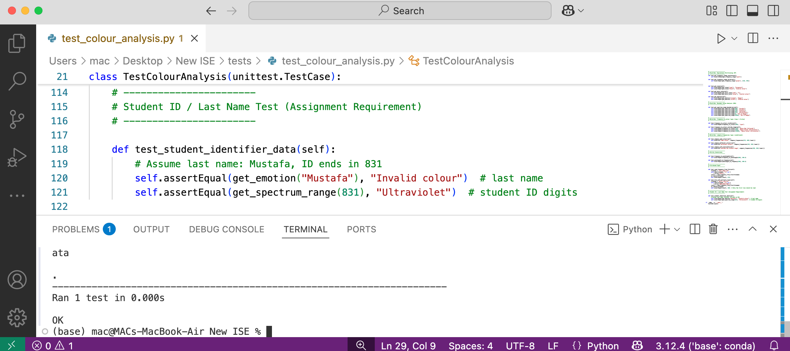  

---

All tests executed correctly, validating:

- Core logic for spectrum conversion.
- File I/O handling and edge-case reading.
- Correct classification of colours and frequency ranges.
- Compliance with assignment-specific constraints.

Each unit test passed independently with 0 errors or failures, confirming the robustness and correctness of the modular implementation.

----
### How to Run Tests

Run the following command from the root directory:

```bash
python3 -m unittest discover -s tests

```
----
### Execution Results
All implemented test cases executed successfully. A summary output screenshot is shown below:

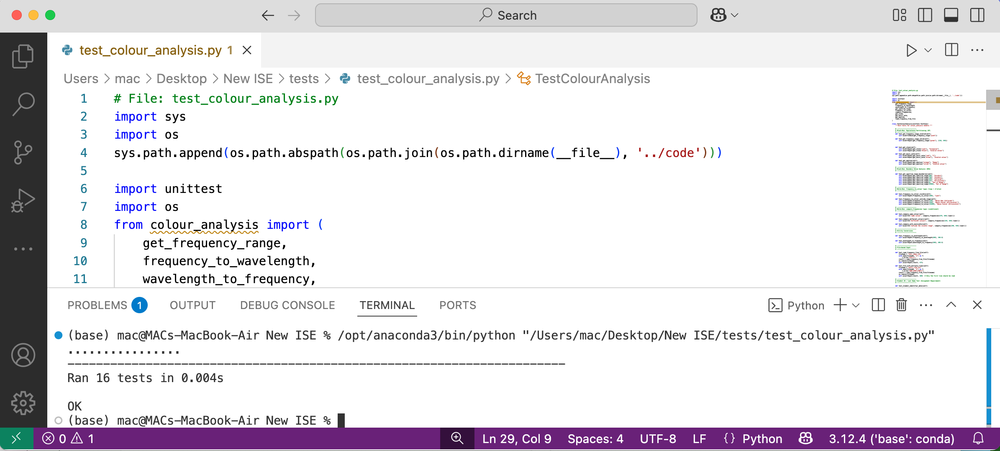  

----

## Summary of Work (Traceability Matrix)

The table maps each module in the curriculum to testing methods, input and output strategies and types of data. It makes it possible to track the whole process from implementation to testing.

----

| Module Name                | BB (EP) | BB (BVA) | WB  | Data Types       | Input/Output Method     | EP Implemented | BVA Implemented | WB Implemented |
|----------------------------|:-------:|:--------:|:---:|------------------|--------------------------|----------------|------------------|----------------|
| `get_frequency_range`      | ✅      | ❌       | ❌  | String           | Keyboard / Return        | ✅              | ❌                | ❌              |
| `get_stone`                | ✅      | ❌       | ❌  | String           | Keyboard / Return        | ✅              | ❌                | ❌              |
| `get_music_note`           | ✅      | ❌       | ❌  | String           | Keyboard / Return        | ✅              | ❌                | ❌              |
| `get_emotion`              | ✅      | ❌       | ❌  | String           | Keyboard / Return        | ✅              | ❌                | ❌              |
| `get_spectrum_range`       | ✅      | ✅       | ❌  | Integer          | Keyboard / Return        | ✅              | ✅                | ❌              |
| `frequency_to_colour`      | ❌      | ❌       | ✅  | Integer          | Return                   | ❌              | ❌                | ✅              |
| `compare_frequencies`      | ❌      | ❌       | ✅  | Integer          | Return                   | ❌              | ❌                | ✅              |
| `frequency_to_wavelength`  | ✅      | ❌       | ✅  | Integer / Float  | File / Return            | ✅              | ❌                | ✅              |
| `wavelength_to_frequency`  | ✅      | ❌       | ✅  | Integer / Float  | Keyboard / Return        | ✅              | ❌                | ✅              |
| `read_frequency_from_file` | ✅      | ❌       | ❌  | Integer          | File Read / Return       | ✅              | ❌                | ❌              |

----
## Version Control

Git was used to manage the project’s versions which were hosted on GitHub in a publicly available repository.

### Repository Structure:
Repositories are kept simple and tidy, placing source code, scripts for tests, documentation material and example data into their own folders. This structure ensures maintainability, ease of navigation, and scalability for future enhancements.

```text
ISErepo/
├── code/
│   ├── colour_analysis.py              # Main CLI program implementing modular colour analysis
│   ├── frequency.txt                   # Sample input file with a single frequency value
│   ├── frequency_visible.txt           # Sample file containing a visible range frequency (e.g., 600 THz)
│   ├── frequency_ultraviolet.txt       # Sample file with ultraviolet frequency (e.g., 800 THz)
│   ├── frequency_edge_visible.txt      # File with boundary frequency (e.g., 790 THz)
│   ├── frequency_outofrange.txt        # File containing an out-of-range frequency (e.g., 31000 THz)
│
├── tests/
│   └── test_colour_analysis.py         # Unit tests using Python's unittest framework for all modules
│
├── documents/
│   └── MuhammadMustafaGhauri_21856831_ISEReport.pdf            # PDF version of the final assessment report
│
├── screenshots/
│   └── *.png                           # Screenshots capturing version control logs and test execution
│
└── README.md                           # Markdown report documenting the assessment work and outcomes
```

---

### GitHub Commit Log Evidence

Below are screenshots taken from the GitHub interface to verify continuous integration and proper version tracking:

**Codebase updates showing staged commits over multiple hours**


---
**Test files upload and refinement history** 


---
**Overview of README versions demonstrating traceable change** 

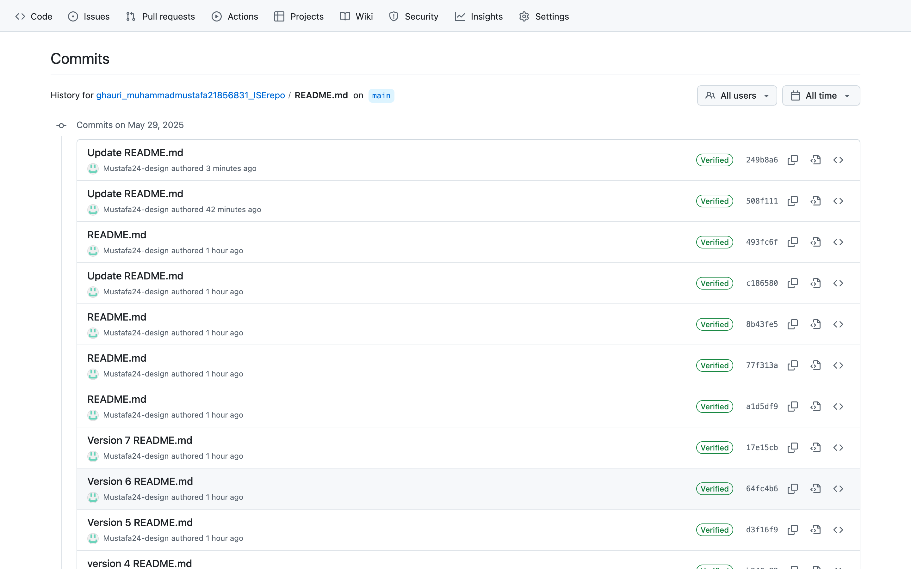

---


---
**Full commit timeline reflecting code, test, and report additions** 

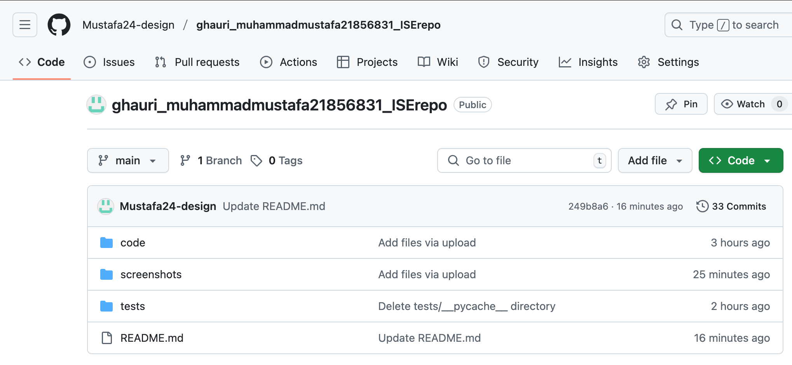
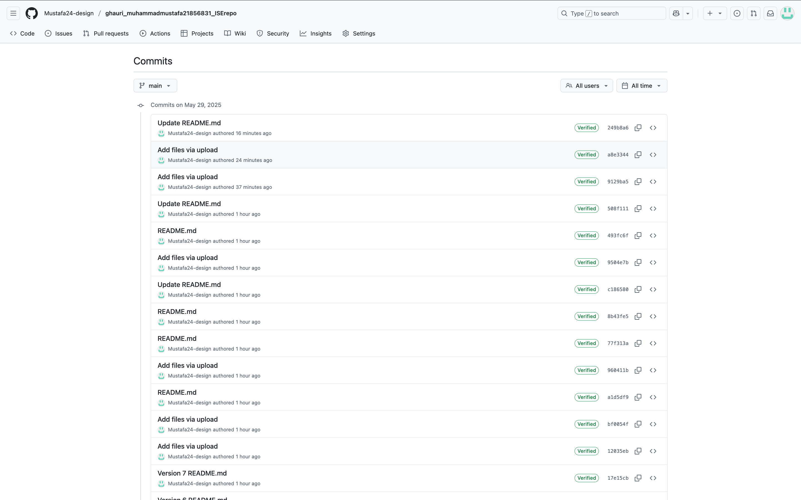

---

### Git Strategy

- **Branch Used**: `main`
- **Commits Made**: 17+
- **Approach**: *Incremental development* — commits were made after each significant update (code implementation, test writing, documentation drafting).
- **Tools Used**: Git CLI and GitHub Web UI

---

### Benefits of Using Version Control

This disciplined version control approach supported:

- Isolating development changes
- Reverting to stable versions when required
- Ensuring traceable documentation history
- Supporting collaborative and modular workflow

---
## Discussion

Using this project, I have been able to build and document a Python application that analyzes colour based on how frequently each colour is input. By following a structured way of working, I managed to carry out all core objectives: making a CLI tool, using modular design, writing tests and version controlling via GitHub and Git. This project made me more familiar with common software engineering practices such as writing tests, putting related parts into objects and recording the project work’s process and status.

One important problem during the implementation was to make sure the program received thorough input and the user interface remained simple. Considering how to test file-based inputs and simulate different edge cases (e.g., wrong values or frequencies beyond the range) was a necessary task. In addition, capturing evidence by running and testing features individually took a lot of time, still greatly improving the quality assurance process.

This version is restricted by the lack of a graphical or web interface that could simplify its use for users without software skills. From my experience, I’ll add visual graphs and explore publishing the tool as a web application. Increasing robustness in the system and making it easier for users to use the application can be achieved by handling exceptions for each module and adding support for different languages. All things considered, this assignment taught me how to write code meant for production, along with proper documentation, testing and version control, prepared to meet professional software development criteria.

---
